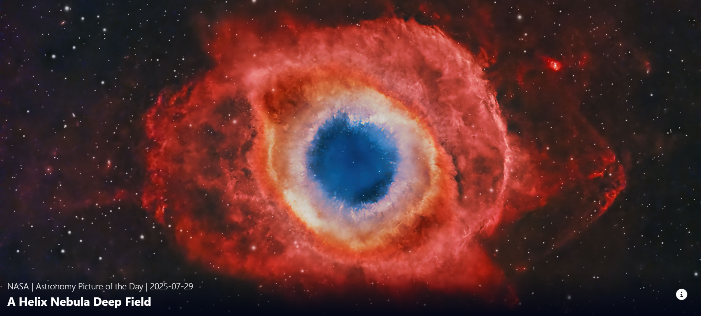
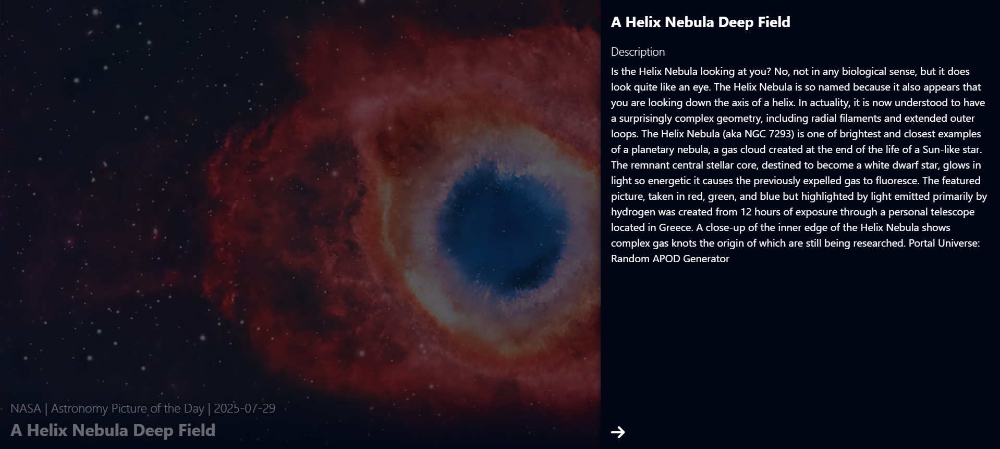

# 🌌 NASA APOD React App

A React-based web application that displays the Astronomy Picture of the Day (APOD) from NASA's public API. Users can view the featured image along with its title and description in a sleek, responsive layout.

## 🌐 Live Demo
🔗 Check out the live app here: https://nasa-apod-react-2025.netlify.app

## 📸 Screenshots

## ✨ Features

- 📸 Fetches the Astronomy Picture of the Day from NASA's API
- 💾 Uses `localStorage` to cache daily results and reduce API calls
- 📱 Responsive design with mobile-first layout
- 📂 Sidebar overlay to view image details
- ⚙️ Loading state while fetching data
